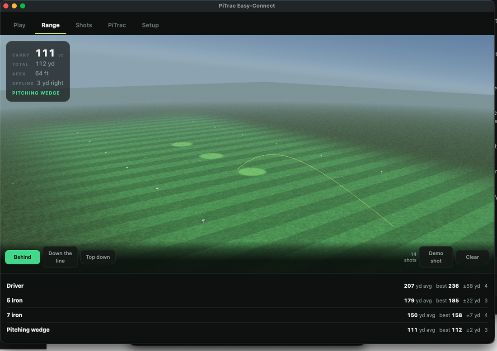
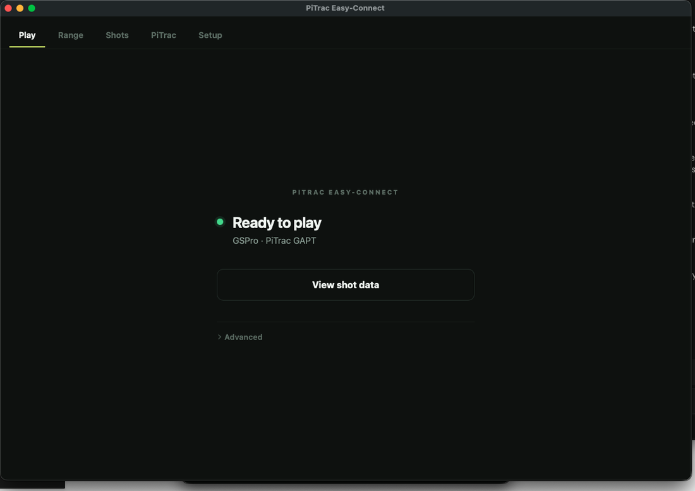
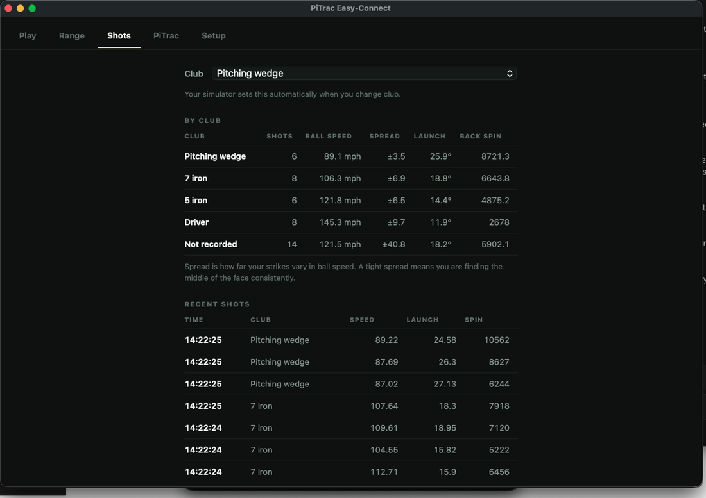
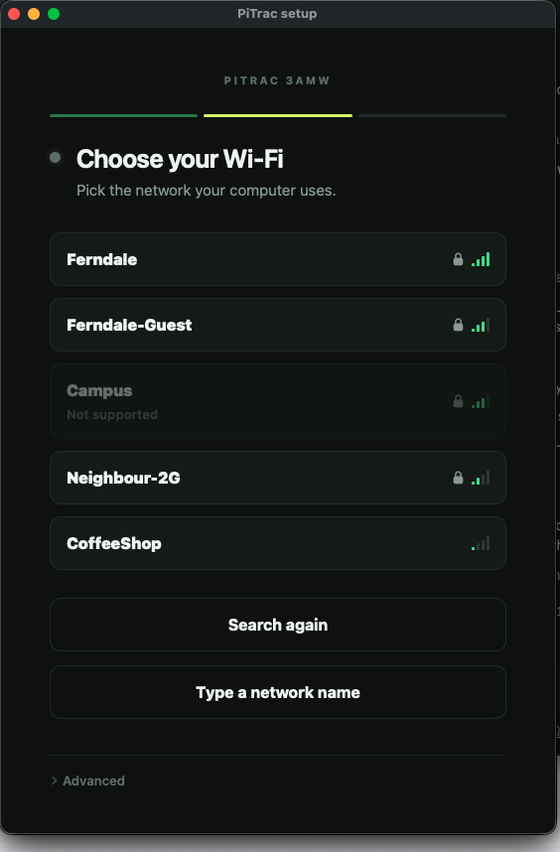

# PiTrac Easy-Connect

**Connect your PiTrac enclosure to Wi-Fi and send shots to GSPro or E6 Connect from one desktop app.**

PiTrac Easy-Connect makes a PiTrac launch monitor easier to set up and use. It includes a small program that runs on the Raspberry Pi inside the enclosure and a desktop app for macOS and Windows. The app connects the enclosure to your home Wi-Fi, finds it automatically, and sends each measured shot to GSPro or E6 Connect. It also includes PiTrac's dashboard, shot history, and a practice range.

A five-step guide walks you through the first setup. If you move the enclosure to another home, you only need to choose the new Wi-Fi network. You do not need to reconfigure PiTrac.

- **Download:** <https://tylerpardun.github.io/pitrac-easy-connect/>
- **Version:** 0.3.0
- **License:** [MIT](LICENSE)



*Each shot follows a path based on its measured launch data, with the shot pattern for each club shown below.*

---

## What Easy-Connect Does

| Capability | Details |
|---|---|
| **Wi-Fi setup** | Scan for nearby networks and connect the enclosure from the app. Known networks appear first and reconnect automatically when the enclosure is turned on |
| **First-time connection** | Before the enclosure is connected to your home Wi-Fi, it creates a temporary network of its own. This lets you complete setup from a phone or laptop |
| **Connection recovery** | If a new Wi-Fi connection fails, the enclosure returns to the previous network within two and a half minutes. It can also recover if power is lost during the change |
| **Find and connect** | The app finds the enclosure automatically. One click links the app and enclosure, and other computers cannot connect unless the owner allows them |
| **Simulator connection** | Sends each measured shot to GSPro or E6 Connect |
| **Setup and system checks** | A five-step guide handles the first setup. The app also checks that the cameras, calibration, software, storage, and other essentials are ready, then explains anything that needs attention |
| **Shot history and practice range** | Saves every shot with its club and captured images. The built-in range shows ball flight, distance, height, accuracy, and shot patterns without GSPro, E6 Connect, an account, or an internet connection |
| **Dashboard and settings** | Includes PiTrac's dashboard and tools to back up, restore, update, or reset the enclosure for a new owner |

### What it looks like

| | |
|---|---|
|  |  |
| **One line and one next step.** The app tells you whether the system is ready and, if not, what needs attention. | **Every shot stays with its club**, along with ball speed, launch, spin, and shot pattern, so you can see what each club is actually doing. |



**Wi-Fi setup from the app.** If the enclosure has never joined a network, it
creates a temporary one so you can set it up from a phone or laptop. Known
networks appear first, a padlock marks those that require a password, and signal
strength is easy to see.

If the new network does not work, the enclosure restores the previous one within
two and a half minutes. It can also recover if power is lost during the change.
This prevents a failed network change from leaving you unable to reconnect.

<br clear="right">

---

## How It Works

PiTrac sends each measured shot to Easy-Connect inside the enclosure. The desktop app receives it over your home Wi-Fi and passes it to the simulator running on the same computer.

```
PiTrac enclosure  →  Home Wi-Fi  →  Easy-Connect app  →  GSPro / E6 Connect
```

The app finds the enclosure automatically, limits access to computers you have approved, and does not require a Windows firewall rule. Changing homes or Wi-Fi networks does not change PiTrac's setup.

---

## Install on the Raspberry Pi

PiTrac itself must already be installed and working — see
[PiTracLM/PiTrac](https://github.com/PiTracLM/PiTrac). If you are starting with
a blank memory card, install PiTrac first by following
[PiTracLM's own instructions](https://github.com/PiTracLM/PiTrac).
It covers the entire process, from flashing the card to running the launch
monitor.

Once PiTrac is working, copy this repository to the Pi and run:

```bash
sudo ./packaging/pi/install.sh
```

The installer checks the enclosure, installs and starts Easy-Connect, prepares
PiTrac to send shots to the app, and prints the **owner card**.

> **Photograph the owner card.** Its setup Wi-Fi password is generated for that
> Pi alone, and it is the only way to reconnect if the enclosure cannot reach
> a network.

Re-run the same installer to upgrade. Your setup, saved Wi-Fi networks,
connected computers, and camera calibration are all preserved.

---

## Install the desktop app

Download the build for your computer from
<https://tylerpardun.github.io/pitrac-easy-connect/>:

| Platform | File |
|---|---|
| macOS 11+, Apple silicon | `PiTrac-Easy-Connect-macos.zip` |
| Windows 11 | `PiTrac-Easy-Connect-windows.zip` |
| Linux, or any OS with Python 3.9+ | `PiTrac-Easy-Connect-*.pyz` |

Neither native build is code signed yet, so both operating systems warn the
first time:

| Platform | What to do |
|---|---|
| macOS | Right-click the app and choose **Open** rather than double-clicking |
| Windows | Choose **More info**, then **Run anyway** |

Open the app and follow five steps: find the enclosure, choose your simulator,
open it, send a test shot, and play. The guide does not appear again after
the first-time setup, but you can reopen it with **Advanced → Run setup again**.

---

## Build the app from source (optional)

Building from source requires Python 3.9 or newer. PyInstaller bundles the
interpreter for the platform on which it runs, so Windows executables must be
built on Windows and macOS apps on macOS. Cross-compiling is not supported.

```bash
git clone https://github.com/TylerPardun/pitrac-easy-connect
cd pitrac-easy-connect
./packaging/build-app.sh
```

The build is written to `dist/` as `PiTrac Easy-Connect.app` on macOS or
`PiTrac Easy-Connect.exe` on Windows. If PyInstaller or pywebview is missing,
the build script installs it. PyInstaller is only used while building;
pywebview is bundled into the app and draws its window, so it ships with it.

| Flag | Description |
|---|---|
| *(none)* | Native app — `.app` on macOS, `.exe` on Windows |
| `--pyz` | Portable single file, runs anywhere Python 3.9+ is installed |
| `--all` | Both |

---

## Licensing

**Easy-Connect is licensed under the MIT License.** PiTrac itself is GPL-2.0 and belongs to [PiTracLM](https://github.com/PiTracLM/PiTrac).
PiTrac does the hard work, and it is not my project. Easy-Connect handles the setup and connectivity around it so the launch monitor is easier to install, move, and use.
